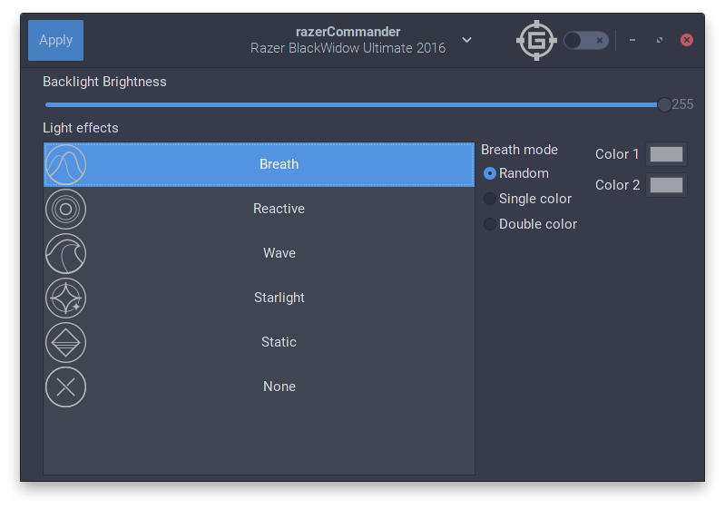

    This program is free software: you can redistribute it and/or modify
    it under the terms of the GNU General Public License as published by
    the Free Software Foundation, either version 3 of the License, or
    (at your option) any later version.

    This program is distributed in the hope that it will be useful,
    but WITHOUT ANY WARRANTY; without even the implied warranty of
    MERCHANTABILITY or FITNESS FOR A PARTICULAR PURPOSE.  See the
    GNU General Public License for more details.

    You should have received a copy of the GNU General Public License
    along with this program.  If not, see <http://www.gnu.org/licenses/>.

#razerCommander

A simple GTK control center for managing razer peripherals on Linux.

#WARNING!

As staded in the License header up there:

> This program is distributed in the hope that it will be useful, but **WITHOUT ANY WARRANTY**

This software is experimental and requires root access. Moreover it's based off an unofficial driver for razer peripherals.

Using this software you're risking to mess up your OS, and for what I know you could also be burning your precious razer product, so be very careful.

***Let's get to the real business now***

##Installing

To install this software the first thing you need is to install `razer-chroma-drivers`: an unofficial driver for razer peripherals for Linux. Go to the [project page](https://github.com/pez2001/razer_chroma_drivers/) to find out more about it and how to install it.

Once you're done, you'll need the following libraries to make razerCommander work:
- GTK+ >3.16 (could work with previous versions, but I'm not sure)
- python3
- gksu

Also it's important to notice that you need to have administrator access on your machine for this program to work.

##Running

*Note: as now razerCommander connects only to the first razer peripheral it can find. It's a temporary behavior, it will be fixed in future releases.*

- Clone this repo (`git clone https://github.com/gabmus/razercommander`)
- `cd` into the newly cloned folder
- Either run `chmod +x main.py` and `main.py`; or `python3 main.py`

To avoid getting asked your root password every time you have to make a change in razerCommander, just run the program as `sudo python3 main.py` or `sudo ./main.py`.

##Supported hardware

As far as support goes, theorically this software should support every device supported by the `razer-chroma-drivers` package.

In practice the only device I tested this on is on my razer Blackwidow Ultimate 2016.

##How can you help?

Please, fill up issues and help me test this little piece of software with as much hardware as possible.
