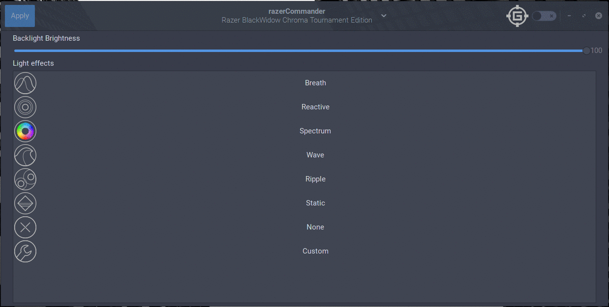

    This program is free software: you can redistribute it and/or modify
    it under the terms of the GNU General Public License as published by
    the Free Software Foundation, either version 3 of the License, or
    (at your option) any later version.

    This program is distributed in the hope that it will be useful,
    but WITHOUT ANY WARRANTY; without even the implied warranty of
    MERCHANTABILITY or FITNESS FOR A PARTICULAR PURPOSE.  See the
    GNU General Public License for more details.

    You should have received a copy of the GNU General Public License
    along with this program.  If not, see <http://www.gnu.org/licenses/>.

# [razerCommander](https://gabmus.github.io/razerCommander)



Razer device manager for Linux

## Supported hardware

Any of the devices supported by the driver stack should work fine in razerCommander.

For a detailed list of supported devices refer to [this page](https://github.com/terrycain/razer-drivers#device-support)

-   Keyboards
-   Macro keypads (Tartarus, Orbweaver)
-   Mice
-   Laptops ***(keyboards only)***
-   Headsets ***(possibly, untested)***
-   Mousepads (Firefly)

## Requirements

To install this software the first thing you need is to install `razer_drivers`. You can find installation instructions on the [project page](https://github.com/terrycain/razer-drivers).

You need 3 packages provided by `razer-drivers`:
-   `razer-driver-dkms`: the actual driver, best if installed using DKMS
-   `razer-daemon`: a daemon that interfaces with the driver, providing a higher level interface for it
-   `python3-razer`: a python library that interfaces with the daemon, it's used by razerCommander, thus it's a direct dependency.

## Installing

### Installing on Arch Linux/Antergos/Manjaro

You can find razerCommander on AUR, as `razercommander-git` ([AUR page](https://aur.archlinux.org/packages/razercommander-git)).
If you use an AUR helper, it should automatically pull `razer-driver-dkms`, `razer-daemon` and `python-razer` as dependencies.

Alternatively you can install these packages manually, or even opt for the git version of the driver stack (`razer-driver-dkms-git`, `razer-daemon-git`, `python-razer-git`).

### Installing on Ubuntu/Debian

**Note**: you will need python 3.6+ to run razerCommander. Here's [how to install python 3.6 on Ubuntu 16.04](https://askubuntu.com/questions/865554/how-do-i-install-python-3-6-using-apt-get/865569#865569)

Go to the [releases page](https://github.com/GabMus/razerCommander/releases) and download the latest release available for your platform.

Alternatively you can build a .deb package following the instructions below.

### Installing on Fedora/RHEL/CentOS

Go to the [releases page](https://github.com/GabMus/razerCommander/releases) and download the latest release available for your platform.

Alternatively you can build a .rpm package following the instructions below.

### Other distros

You can either run razerCommander without installing it (refer to the [Building for testing section](#building-for-testing)), or install it in your system (refer to the [Installing systemwide directly section](#build-and-install-systemwide-directly)).

## Building

### Building for testing

This is the best practice to test razerCommander without installing using meson and ninja.

#### First time

```bash
git clone https://github.com/gabmus/razercommander
cd razercommander
mkdir builddir
cd builddir
meson ..
mesonconf -Dprefix=$(pwd)/testdir
ninja install # This will actually install in razercommander/builddir/testdir
ninja run
```

#### Later on

```bash
cd razercommander/builddir
ninja install # This will actually install in razercommander/builddir/testdir
ninja run
```

### Building for Debian/Ubuntu

WIP

### Building for Fedora/RHEL/CentOS

WIP

### Building for Flatpak

WIP

### Build and install systemwide directly

This approach is discouraged, since it will manually copy all the files in your system. Uninstalling could be difficult and/or dangerous.

But if you know what you're doing, here you go:

```bash
git clone https://github.com/gabmus/razercommander
cd razercommander
mkdir builddir
cd builddir
meson ..
ninja install
```

## How can you help?

Please, fill up issues and help me test this little piece of software with as much hardware as possible.
